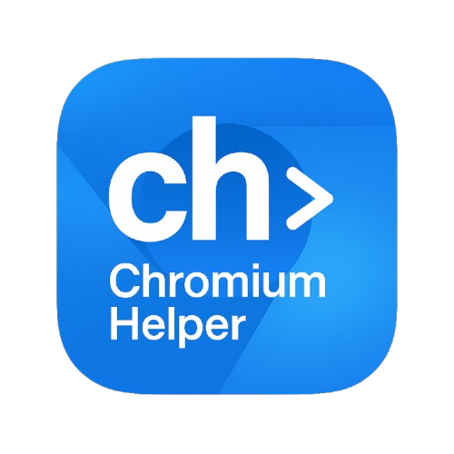

<div align="center">



</div>

# Chromium Helper

The ultimate toolkit for exploring Chromium and PDFium source code, offering both a powerful standalone CLI and an AI-integrated MCP server.

---

# 🔧 Chromium Helper CLI

**Standalone CLI tool - No MCP required!** Search and explore Chromium source code directly from your terminal.

## ✨ Quick Start

### Option 1: Use Instantly (No Installation)
```bash
# Run directly with npx - no installation needed!
npx chromium-helper search "LOG(INFO)" --limit 5
npx chromium-helper gerrit status 6624568
npx chromium-helper pdfium status 130850
npx chromium-helper issues search "memory leak"
```

### Option 2: Install Globally
```bash
# Install once, use anywhere with short alias
npm install -g chromium-helper

# Then use with short 'ch' command
ch search "LOG(INFO)" --limit 5
ch gerrit status 6624568
ch pdfium status 130850
ch issues search "memory leak"
```

## 🎯 Key Features

- **🔍 Advanced Code Search** - Search Chromium and PDFium with powerful syntax
- **🔧 Complete Gerrit Integration** - CL status, comments, diffs, file content  
- **🤖 Try-Bot Status** - View LUCI try-bot results for CLs
- **🐛 Issue Tracking** - Search and view Chromium issues
- **📊 PDFium Support** - Full PDFium Gerrit operations
- **📝 Commit History** - Search commits, authors, dates
- **👥 Code Ownership** - Find OWNERS files and reviewers
- **⚡ Real-time Data** - Uses official Google APIs
- **🤖 AI-Friendly** - JSON output for automation

## 📖 Full CLI Documentation

👉 **[Complete CLI Guide & Examples](./chromium-helper-cli/README.md)**

## 🚀 Example Commands

```bash
# Code search
ch search "CreateWindow" --type function --limit 10
ch symbol Browser::Create
ch file "base/logging.cc" --lines 100-200

# Gerrit operations  
ch gerrit status 6624568
ch gerrit comments 6624568 --unresolved-only
ch gerrit diff 6624568 --file "chrome/browser/ui/browser.cc"
ch gerrit bots 6624568 --failed-only

# Issue tracking
ch issues search "memory leak" --limit 20
ch issues get 422768753

# PDFium
ch pdfium status 130850
ch pdfium diff 130850
ch pdfium bots 130850

# Commit history & ownership
ch commits "password manager" --author "chrome-team" --since "2025-06-01"
ch owners "chrome/browser/ui/browser.cc"
```

---

# 🤖 Chromium CodeSearch MCP Server

For AI systems and Claude Desktop integration - provides the same powerful functionality via Model Context Protocol.

## ⚡ Quick Start

### Option 1: Use Instantly (No Installation)
```bash
# Run directly with npx - no installation needed!
npx chromium-codesearch-mcp

# Test it works
echo '{"query": "LOG(INFO)", "limit": 3}' | npx chromium-codesearch-mcp search_chromium_code
```

### Option 2: Install Globally  
```bash
# Install once for faster startup
npm install -g chromium-codesearch-mcp

# Then use directly
chromium-codesearch-mcp
```

## 🎯 MCP Features

A powerful MCP server that provides comprehensive access to Chromium and PDFium source code repositories via Google's official CodeSearch APIs.

- **🔍 Advanced Code Search** - Search with Google's Code Search syntax
- **🎯 Symbol Lookup** - Find definitions, declarations, and usage examples  
- **🔧 Complete Gerrit Integration** - CL status, review comments, diffs, and file content
- **🐛 Issue Tracking** - Search and fetch detailed Chromium issue information
- **📊 PDFium Support** - Full support for PDFium Gerrit operations
- **📝 Commit History** - Search commit messages, author activity, and development history
- **👥 Code Ownership** - Find OWNERS files and reviewers for any file or directory
- **🔗 Direct Links** - Every result includes clickable URLs to view code online
- **⚡ Real-time Data** - Uses the same backend infrastructure as official Google sites

## 🛠️ MCP Tools Available

### Core Search & Navigation
- **`search_chromium_code`** - Advanced code search with filtering options
- **`find_chromium_symbol`** - Symbol definitions and usage examples
- **`get_chromium_file`** - File content with line number ranges

### Chromium Gerrit Integration  
- **`get_gerrit_cl_status`** - CL status, test results, submit requirements
- **`get_gerrit_cl_comments`** - Review comments with code context
- **`get_gerrit_cl_diff`** - Code changes and file modifications
- **`get_gerrit_patchset_file`** - File content from specific patchsets

### PDFium Gerrit Integration
- **`get_pdfium_gerrit_cl_status`** - PDFium CL status and test results
- **`get_pdfium_gerrit_cl_comments`** - PDFium review comments  
- **`get_pdfium_gerrit_cl_diff`** - PDFium code changes
- **`get_pdfium_gerrit_patchset_file`** - PDFium file content from patchsets

### Issue Tracking & History
- **`get_chromium_issue`** - Detailed issue information with browser automation
- **`search_chromium_issues`** - Search issues with full-text and pagination
- **`search_chromium_commits`** - Commit history search with date filtering
- **`find_chromium_owners_file`** - Code ownership and reviewer discovery

## 📋 Claude Desktop Configuration

Add to your `claude_desktop_config.json`:

```json
{
  "mcpServers": {
    "chromium-codesearch": {
      "command": "chromium-codesearch-mcp"
    }
  }
}
```

## 💡 Example MCP Usage

**Search for code patterns:**
```
Use search_chromium_code to find "WTF::Partitions" usage with limit 5
```

**Find symbol definitions:**
```
Use find_chromium_symbol to find "Browser::Create" definitions and examples
```

**Check Gerrit CL status:**
```
Use get_gerrit_cl_status to check the status of CL 6624568
```

**Search for issues:**
```
Use search_chromium_issues to find all issues related to "memory leak"
```

## 🏗️ Installation Options

### Option 1: From npm (Recommended)
```bash
npm install -g chromium-codesearch-mcp
```

### Option 2: Using npx (No Installation)
```bash
npx chromium-codesearch-mcp
```

### Option 3: From Source
```bash
git clone https://github.com/hjanuschka/chromium-helper.git
cd chromium-helper
npm install
npm run build
```

## 🔧 Development

- `npm run build` - Build TypeScript code
- `npm run dev` - Watch for changes and rebuild  
- `npm start` - Start the MCP server

## 📊 Implementation Details

This MCP server uses Google's **official Chromium CodeSearch API**:
- **Endpoint**: `https://grimoireoss-pa.clients6.google.com/batch`
- **Real-time**: Searches the live Chromium repository
- **Authentication**: Uses public API (configurable with `CHROMIUM_SEARCH_API_KEY`)
- **Features**: Match highlighting, pagination, rich metadata

## 🎯 Use Cases

### AI & Automation
- Integrate Chromium code search into AI workflows
- Automated code analysis and review assistance
- Real-time code exploration for development tools

### Development & Research  
- Deep-dive code exploration for complex features
- Security research and vulnerability analysis
- Architecture understanding and documentation
- Performance optimization research

### Code Review & Quality
- Enhanced Gerrit review workflows
- Issue tracking and bug investigation
- Code ownership and reviewer discovery
- Commit history analysis

## 📜 License

MIT License - see [LICENSE](LICENSE) for details.

## 🤝 Contributing

Contributions welcome! Please read the contributing guidelines and submit issues or pull requests.

---

<div align="center">

**Made with ❤️ for the Chromium community**

[🚀 Get Started with CLI](./chromium-helper-cli/README.md) • [🤖 MCP Documentation](#-chromium-codesearch-mcp-server) • [📋 Report Issues](https://github.com/hjanuschka/chromium-helper/issues)

</div>