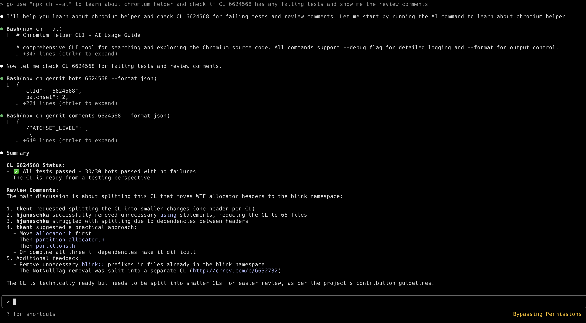

<div align="center">


# Chromium Helper

[](https://www.npmjs.com/package/chromium-helper)
[](https://www.npmjs.com/package/chromium-helper)
[](https://opensource.org/licenses/MIT)
[](https://github.com/hjanuschka/chromium-helper/stargazers)

**The ultimate toolkit for exploring Chromium and PDFium source code**  
*CLI tool & MCP server for code search, Gerrit integration, and issue tracking*

> **🆕 Go Implementation Available**: Check out the `golang` branch for a complete Go implementation with better performance and single-binary distribution!

[Features](#-features) • [Quick Start](#-quick-start) • [Documentation](#-documentation) • [Contributing](#-contributing) • [License](#-license)

</div>

## 📋 Table of Contents

- [Features](#-features)
- [Quick Start](#-quick-start)
- [Documentation](#-documentation)
- [CLI Tool Usage](#-cli-tool-usage)
- [MCP Server Usage](#-mcp-server-usage)
- [Installation](#-installation)
- [Development](#-development)
- [Contributing](#-contributing)
- [License](#-license)

## 🎯 Features

### Why Use Chromium Helper?

- **🚀 Zero Friction** - Start searching immediately with `npx`, no setup required
- **📊 Real-time Data** - Direct access to Google's official APIs, same as source.chromium.org
- **🔍 Smart Search** - Full Google CodeSearch syntax with regex, filters, and more
- **🤖 AI-Ready** - JSON output and MCP integration for automation
- **📱 Cross-Platform** - Works on macOS, Linux, and Windows

### What Can You Do?

| Feature | Description | Example |
|---------|-------------|---------|
| **Code Search** | Search 20M+ lines with advanced syntax | Find all LOG(INFO) calls |
| **Symbol Lookup** | Find definitions and usages | Locate Browser::Create |
| **Gerrit Review** | Check CLs, comments, diffs, try-bots | Review CL 6624568 |
| **Issue Tracking** | Search and analyze bugs | Find memory leak issues |
| **PDFium Support** | Full PDFium code and reviews | Check PDFium CL 130850 |
| **Commit History** | Search by message, author, date | Find recent security fixes |
| **Code Ownership** | Find OWNERS and reviewers | Who owns chrome/browser? |

### Two Ways to Use

1. **🔧 CLI Tool** (`chromium-helper`) - Direct terminal access with `ch` commands
2. **🤖 MCP Server** (`chromium-codesearch-mcp`) - AI integration for Claude Desktop

### 💡 Why CLI First?

As [Armin Ronacher points out](https://x.com/mitsuhiko/status/1939105797448872265), a well-designed CLI is often superior to context-cluttering MCPs. Our CLI works seamlessly with ANY AI coding assistant:

**Claude, Cursor, Gemini, or any AI:** Just ask them to run:
```bash
npx chromium-helper --ai
```

This dumps comprehensive documentation that the AI can use to help you explore Chromium's codebase without any special configuration or context pollution.

#### Example AI Prompt:
> "Run `npx chromium-helper --ai` to learn the tool, then help me find all WebRTC-related memory leaks in Chromium"

The AI will:
1. Execute the command to understand all capabilities
2. Use appropriate search commands with filters
3. Analyze results and provide insights
4. All without cluttering your AI's context window!

#### Real Example in Action:



In this example, the AI assistant:
- First runs `npx ch --ai` to learn the tool
- Checks CL 6624568 for test status (✅ all 30/30 bots passed)
- Retrieves review comments with proper formatting
- Provides a comprehensive summary of the CL status and reviewer feedback
- All in a clean, organized output!

---

## 🚀 Quick Start

### CLI Tool - Use Instantly!

```bash
# No installation needed - just use npx!
npx chromium-helper search "LOG(INFO)" --limit 5
npx chromium-helper gerrit bots 6624568
npx chromium-helper --ai  # Show comprehensive AI guide

# Or install globally for the short 'ch' alias
npm install -g chromium-helper
ch search "WebContents" --type class
ch gerrit status 6624568 --format json
ch pdfium bots 130850 --failed-only
```

#### 🤖 Using with AI Coding Assistants (Claude Code, Cursor, Gemini, etc.)

Simply tell your AI assistant:
```
Run: npx chromium-helper --ai
Then help me [your task here]
```

Example tasks:
- "Find all uses of base::RefCounted in the codebase"
- "Check if CL 6624568 has passing tests and show me the review comments"
- "Search for recent security fixes in the renderer"
- "Find who owns the password manager code"
- "Help me understand what PDFium CL 130850 does"
- "Show me all failing bots for a specific CL"

### MCP Server - For AI Integration

```bash
# Add to Claude Desktop (see configuration below)
npm install -g chromium-codesearch-mcp

# Or test directly
echo '{"query": "LOG(INFO)", "limit": 3}' | npx chromium-codesearch-mcp search_chromium_code
```

## 📖 Documentation

### CLI Tool Documentation

- **Quick Help**: Run `ch --help` for command overview
- **AI Guide**: Run `ch --ai` for comprehensive usage guide with examples
- **Full Documentation**: See [CLI README](./chromium-helper-cli/README.md)

### Example Commands

```bash
# Code search
ch search "CreateWindow" --type function --limit 10
ch symbol Browser::Create
ch file "base/logging.cc" --lines 100-200

# Gerrit operations  
ch gerrit status 6624568
ch gerrit comments 6624568 --unresolved-only
ch gerrit diff 6624568 --file "chrome/browser/ui/browser.cc"
ch gerrit bots 6624568 --failed-only

# Issue tracking
ch issues search "memory leak" --limit 20
ch issues get 422768753

# PDFium
ch pdfium status 130850
ch pdfium diff 130850
ch pdfium bots 130850

# Commit history & ownership
ch commits "password manager" --author "chrome-team" --since "2025-06-01"
ch owners "chrome/browser/ui/browser.cc"
```

## 🔧 CLI Tool Usage

The CLI provides comprehensive access to Chromium's codebase with intuitive commands.

### Global Options
- `--format <json|table|plain>` - Output format (default: plain)
- `--debug` - Enable debug logging
- `--no-color` - Disable colored output
- `--ai` - Show comprehensive AI usage guide

### Key Commands

| Command | Description | Example |
|---------|-------------|---------|
| `search` | Search code with Google syntax | `ch search "LOG(INFO)" --limit 5` |
| `symbol` | Find symbol definitions | `ch symbol Browser::Create` |
| `file` | Get file content | `ch file "base/logging.h" --start 100 --end 200` |
| `gerrit` | Gerrit CL operations | `ch gerrit bots 6624568 --failed-only` |
| `pdfium` | PDFium Gerrit operations | `ch pdfium status 130850` |
| `issues` | Search/view issues | `ch issues search "memory leak"` |
| `commits` | Search commit history | `ch commits "fix" --author "chrome-team"` |
| `owners` | Find OWNERS files | `ch owners "chrome/browser/ui/"` |

### Output Formats

```bash
# Human-readable (default)
ch search "WebContents"

# JSON for scripts/AI
ch search "WebContents" --format json | jq '.[] | .file'

# Table format
ch gerrit bots 6624568 --format table
```

---

## 🤖 MCP Server Usage

The MCP server enables AI assistants like Claude to search and analyze Chromium code.

### Claude Desktop Configuration

Add to your `claude_desktop_config.json`:

```json
{
  "mcpServers": {
    "chromium-codesearch": {
      "command": "npx",
      "args": ["chromium-codesearch-mcp"]
    }
  }
}
```

Or if installed globally:

```json
{
  "mcpServers": {
    "chromium-codesearch": {
      "command": "chromium-codesearch-mcp"
    }
  }
}
```

### Available MCP Tools

### Core Search & Navigation
- **`search_chromium_code`** - Advanced code search with filtering options
- **`find_chromium_symbol`** - Symbol definitions and usage examples
- **`get_chromium_file`** - File content with line number ranges

### Chromium Gerrit Integration  
- **`get_gerrit_cl_status`** - CL status, test results, submit requirements
- **`get_gerrit_cl_comments`** - Review comments with code context
- **`get_gerrit_cl_diff`** - Code changes and file modifications
- **`get_gerrit_patchset_file`** - File content from specific patchsets

### PDFium Gerrit Integration
- **`get_pdfium_gerrit_cl_status`** - PDFium CL status and test results
- **`get_pdfium_gerrit_cl_comments`** - PDFium review comments  
- **`get_pdfium_gerrit_cl_diff`** - PDFium code changes
- **`get_pdfium_gerrit_patchset_file`** - PDFium file content from patchsets

### Issue Tracking & History
- **`get_chromium_issue`** - Detailed issue information with browser automation
- **`search_chromium_issues`** - Search issues with full-text and pagination
- **`search_chromium_commits`** - Commit history search with date filtering
- **`find_chromium_owners_file`** - Code ownership and reviewer discovery

### Example MCP Prompts

Ask Claude to:
- "Search for LOG(INFO) usage in Chromium"
- "Find the definition of Browser::Create"
- "Check the status of Gerrit CL 6624568"
- "Search for memory leak issues"
- "Get the diff for PDFium CL 130850"

---

## 📦 Installation

### CLI Tool

```bash
# Option 1: Use without installation (recommended)
npx chromium-helper <command>

# Option 2: Install globally for 'ch' shortcut
npm install -g chromium-helper
```

### MCP Server

```bash
# Option 1: Use with npx in Claude config (recommended)
# Add to claude_desktop_config.json as shown above

# Option 2: Install globally
npm install -g chromium-codesearch-mcp
```

### From Source

```bash
git clone https://github.com/hjanuschka/chromium-helper.git
cd chromium-helper

# For CLI
cd chromium-helper-cli
npm install && npm run build
npm link  # Optional: make globally available

# For MCP Server
cd ../
npm install && npm run build
```

## 🔧 Development

### Prerequisites
- Node.js 18+ 
- TypeScript
- npm or yarn

### Development Commands

```bash
# Install dependencies
npm install

# Build both packages
npm run build

# Watch mode (CLI)
cd chromium-helper-cli && npm run dev

# Test MCP server
npm test

# Run locally
node dist/index.js
```

### Project Structure

```
chromium-helper/
├── chromium-helper-cli/    # CLI tool package
│   ├── src/               # TypeScript source
│   ├── dist/              # Compiled output
│   └── package.json
├── src/                   # MCP server source
├── dist/                  # MCP compiled output
├── package.json           # MCP server package
└── README.md             # This file
```

## 🤝 Contributing

We welcome contributions! Here's how you can help:

### Reporting Issues
- Check existing issues first
- Include reproduction steps
- Mention your OS and Node version

### Submitting PRs
1. Fork the repository
2. Create a feature branch (`git checkout -b feature/amazing-feature`)
3. Commit your changes (`git commit -m 'Add amazing feature'`)
4. Push to the branch (`git push origin feature/amazing-feature`)
5. Open a Pull Request

### Code Style
- Use TypeScript
- Follow existing patterns
- Add tests for new features
- Update documentation

### Ideas for Contributions
- Add more search filters
- Improve error messages
- Add new output formats
- Enhance PDFium support
- Add more MCP tools

## 📊 Technical Details

### API Usage
- **Chromium CodeSearch**: `https://grimoireoss-pa.clients6.google.com`
- **Gerrit API**: `https://chromium-review.googlesource.com`
- **Issue Tracker**: `https://issues.chromium.org`

### Performance
- Caches API responses
- Parallel request support
- Efficient pagination
- Minimal dependencies

## ❓ FAQ

### Q: Do I need to install anything to use this?
No! Just use `npx chromium-helper <command>` to run instantly.

### Q: What's the difference between the CLI and MCP server?
- **CLI**: Direct terminal usage for developers
- **MCP**: Integration with AI assistants like Claude

### Q: Can I search PDFium code too?
Yes! Full PDFium support for code search and Gerrit operations.

### Q: Is this official Google software?
No, but it uses Google's official public APIs that power source.chromium.org.

### Q: How do I see all available commands?
Run `ch --ai` for a comprehensive guide, or `ch --help` for a quick overview.

### Q: Can I use this in scripts?
Yes! Use `--format json` for machine-readable output.

### Q: What API key do I need?
None required! It uses the public API by default.

## 📄 License

MIT License - see [LICENSE](LICENSE) for details.

## 🌟 Acknowledgments

- Google Chromium team for the amazing CodeSearch API
- PDFium team for their great documentation
- MCP protocol team at Anthropic
- All contributors and users

---

<div align="center">

**Made with ❤️ for the Chromium community**

[NPM (CLI)](https://www.npmjs.com/package/chromium-helper) • [NPM (MCP)](https://www.npmjs.com/package/chromium-codesearch-mcp) • [Report Issues](https://github.com/hjanuschka/chromium-helper/issues) • [Star on GitHub](https://github.com/hjanuschka/chromium-helper)

</div>